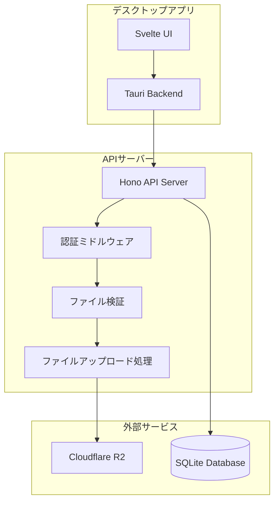

# 設計書

## 概要

現在のデスクトップアプリケーションは、Tauriバックエンド（Rust）から直接Cloudflare R2ストレージにファイルをアップロードしています。この設計では、TypeScriptとHonoフレームワークを使用したAPIサーバーを新たに構築し、ファイルアップロード処理を集約化します。

### 現在のアーキテクチャ
```
デスクトップアプリ（Svelte） → Tauriバックエンド（Rust） → Cloudflare R2
```

### 新しいアーキテクチャ
```
デスクトップアプリ（Svelte） → APIサーバー（TypeScript/Hono） → Cloudflare R2
```

## アーキテクチャ

### システム構成図



### レイヤー構成

1. **プレゼンテーション層**: Svelteフロントエンド
2. **アプリケーション層**: Tauriバックエンド（APIクライアント）
3. **API層**: Hono APIサーバー
4. **ビジネスロジック層**: ファイル処理・認証・検証
5. **データ層**: Cloudflare R2 + SQLiteデータベース

## コンポーネントと インターフェース

### APIサーバーコンポーネント

#### 1. Honoアプリケーション
```typescript
interface HonoApp {
  // メインアプリケーションインスタンス
  app: Hono;
  
  // ミドルウェア設定
  setupMiddleware(): void;
  
  // ルート設定
  setupRoutes(): void;
  
  // サーバー起動
  start(port: number): Promise<void>;
}
```

#### 2. ファイルアップロードサービス
```typescript
interface FileUploadService {
  // 単一ファイルアップロード
  uploadFile(file: File, metadata: UploadMetadata): Promise<UploadResult>;
  
  // 複数ファイル並列アップロード
  uploadMultipleFiles(files: File[], metadata: UploadMetadata[]): Promise<UploadResult[]>;
  
  // ファイル検証
  validateFile(file: File): Promise<ValidationResult>;
  
  // R2アップロード
  uploadToR2(fileKey: string, fileData: Buffer, contentType: string): Promise<string>;
}
```

#### 3. 認証サービス
```typescript
interface AuthService {
  // トークン検証
  validateToken(token: string): Promise<AuthResult>;
  
  // ユーザー認証
  authenticateUser(userId: number): Promise<User>;
  
  // 権限チェック
  checkPermission(userId: number, resource: string): Promise<boolean>;
}
```

#### 4. R2クライアント
```typescript
interface R2Client {
  // ファイルアップロード
  putObject(key: string, data: Buffer, contentType: string): Promise<string>;
  
  // ファイル削除
  deleteObject(key: string): Promise<void>;
  
  // プリサインドURL生成
  generatePresignedUrl(key: string, expiresIn: number): Promise<string>;
  
  // 接続テスト
  testConnection(): Promise<boolean>;
}
```

### APIエンドポイント

#### ファイルアップロード関連
```typescript
// 単一ファイルアップロード
POST /api/v1/receipts/upload
Content-Type: multipart/form-data
Authorization: Bearer <token>

// 複数ファイル並列アップロード
POST /api/v1/receipts/upload/multiple
Content-Type: multipart/form-data
Authorization: Bearer <token>

// ファイル削除
DELETE /api/v1/receipts/:fileKey
Authorization: Bearer <token>

// ファイル取得（プリサインドURL）
GET /api/v1/receipts/:fileKey/url
Authorization: Bearer <token>
```

#### システム関連
```typescript
// ヘルスチェック
GET /api/v1/health

// R2接続テスト
GET /api/v1/system/r2/test
Authorization: Bearer <token>

// システム統計
GET /api/v1/system/stats
Authorization: Bearer <token>
```

## データモデル

### リクエスト/レスポンスモデル

#### ファイルアップロードリクエスト
```typescript
interface UploadRequest {
  file: File;                    // アップロードファイル
  expenseId: number;            // 経費ID
  userId: number;               // ユーザーID
  metadata?: {                  // オプションメタデータ
    description?: string;
    category?: string;
  };
}
```

#### ファイルアップロードレスポンス
```typescript
interface UploadResponse {
  success: boolean;             // 成功フラグ
  fileUrl?: string;            // アップロードされたファイルのURL
  fileKey: string;             // R2ファイルキー
  fileSize: number;            // ファイルサイズ（バイト）
  contentType: string;         // MIMEタイプ
  uploadedAt: string;          // アップロード日時（ISO 8601）
  error?: string;              // エラーメッセージ
}
```

#### 複数ファイルアップロードレスポンス
```typescript
interface MultipleUploadResponse {
  totalFiles: number;          // 総ファイル数
  successfulUploads: number;   // 成功数
  failedUploads: number;       // 失敗数
  results: UploadResponse[];   // 個別結果
  totalDurationMs: number;     // 総処理時間
}
```

#### エラーレスポンス
```typescript
interface ErrorResponse {
  error: {
    code: string;              // エラーコード
    message: string;           // エラーメッセージ
    details?: any;             // 詳細情報
    timestamp: string;         // エラー発生時刻
    requestId: string;         // リクエストID
  };
}
```

### 設定モデル

#### APIサーバー設定
```typescript
interface ApiServerConfig {
  port: number;                // サーバーポート
  host: string;               // バインドホスト
  cors: {
    origin: string[];         // 許可オリジン
    methods: string[];        // 許可メソッド
    headers: string[];        // 許可ヘッダー
  };
  rateLimit: {
    windowMs: number;         // レート制限ウィンドウ
    maxRequests: number;      // 最大リクエスト数
  };
  fileUpload: {
    maxFileSize: number;      // 最大ファイルサイズ
    allowedTypes: string[];   // 許可ファイルタイプ
    maxFiles: number;         // 最大ファイル数
  };
}
```

#### R2設定
```typescript
interface R2Config {
  endpoint: string;            // R2エンドポイント
  accessKeyId: string;        // アクセスキーID
  secretAccessKey: string;    // シークレットアクセスキー
  bucketName: string;         // バケット名
  region: string;             // リージョン
}
```

## 正確性プロパティ

*プロパティとは、システムのすべての有効な実行において真であるべき特性や動作のことです。これらは人間が読める仕様と機械で検証可能な正確性保証の橋渡しとなります。*

### プロパティ1: CORS設定の適切性
*すべての* APIリクエストに対して、適切なCORSヘッダー（Access-Control-Allow-Origin、Access-Control-Allow-Methods、Access-Control-Allow-Headers）が返されること
**検証対象: 要件 1.4**

### プロパティ2: ファイル検証の包括性
*すべての* ファイルアップロードリクエストに対して、ファイル形式、サイズ、およびタイプの検証が実行され、無効なファイルは適切に拒否されること
**検証対象: 要件 2.1, 3.5**

### プロパティ3: 有効ファイルのR2アップロード
*すべての* 有効なファイルに対して、R2ストレージへのアップロードが成功し、アクセス可能なURLが生成されること
**検証対象: 要件 2.2**

### プロパティ4: アップロード成功時のメタデータ返却
*すべての* 成功したファイルアップロードに対して、ファイルURL、ファイルキー、サイズ、コンテンツタイプ、アップロード日時を含むメタデータが返されること
**検証対象: 要件 2.3**

### プロパティ5: 無効ファイルのエラーレスポンス
*すべての* 無効なファイル（サイズ超過、形式不正、タイプ不許可）に対して、適切なエラーコードとメッセージを含む構造化されたエラーレスポンスが返されること
**検証対象: 要件 2.4**

### プロパティ6: マルチパートフォームデータ処理
*すべての* マルチパートフォームデータリクエストが正しく解析され、ファイルデータとメタデータが適切に抽出されること
**検証対象: 要件 2.5**

### プロパティ7: 認証トークン検証
*すべての* 保護されたAPIエンドポイントに対して、有効な認証トークンを持つリクエストは処理され、無効なトークンを持つリクエストは401エラーを返すこと
**検証対象: 要件 3.1, 3.2**

### プロパティ8: レート制限の実装
*すべての* クライアントに対して、設定された時間窓内でのリクエスト数が制限値を超えた場合、429エラーが返されること
**検証対象: 要件 3.3**

### プロパティ9: セキュリティヘッダーの設定
*すべての* APIレスポンスに、適切なセキュリティヘッダー（X-Content-Type-Options、X-Frame-Options、X-XSS-Protection等）が含まれること
**検証対象: 要件 3.4**

### プロパティ10: デスクトップアプリのAPI経由アクセス
*すべての* ファイルアップロード操作において、デスクトップアプリケーションはAPIサーバー経由でアクセスし、R2ストレージへの直接アクセスは行わないこと
**検証対象: 要件 4.1, 4.3**

### プロパティ11: APIレスポンス処理
*すべての* APIサーバーからのレスポンス（成功・エラー問わず）に対して、デスクトップアプリケーションが適切に処理し、ユーザーに適切なフィードバックを提供すること
**検証対象: 要件 4.2**

### プロパティ12: APIサーバー利用不可時のエラーハンドリング
*すべての* APIサーバーが利用できない状況において、デスクトップアプリケーションが適切なエラーメッセージを表示し、アプリケーションがクラッシュしないこと
**検証対象: 要件 4.5**

### プロパティ13: 構造化エラーレスポンス
*すべての* エラー状況において、APIサーバーがエラーコード、メッセージ、詳細情報、タイムスタンプ、リクエストIDを含む構造化されたエラーレスポンスを返すこと
**検証対象: 要件 5.1**

### プロパティ14: 包括的ログ記録
*すべての* リクエスト処理において、適切なログレベル（INFO、WARN、ERROR）でログが出力され、リクエスト/レスポンスのトレーシング情報が記録されること
**検証対象: 要件 5.2, 5.3, 5.4**

### プロパティ15: 重大エラー時のアラート生成
*すべての* 重大なエラー（システム障害、セキュリティ違反等）において、適切なアラートが生成され、管理者に通知されること
**検証対象: 要件 5.5**

### プロパティ16: ヘルスチェックエンドポイント
*すべての* ヘルスチェックリクエストに対して、APIサーバーとR2ストレージの接続状態を含む適切なヘルス情報が返されること
**検証対象: 要件 6.5**

<function_calls>
<invoke name="prework">
<parameter name="featureName">api-server-integration

## エラーハンドリング

### エラー分類

#### 1. バリデーションエラー（400番台）
- **400 Bad Request**: 不正なリクエスト形式
- **401 Unauthorized**: 認証失敗
- **403 Forbidden**: 権限不足
- **413 Payload Too Large**: ファイルサイズ超過
- **415 Unsupported Media Type**: 非対応ファイル形式
- **429 Too Many Requests**: レート制限超過

#### 2. サーバーエラー（500番台）
- **500 Internal Server Error**: 内部サーバーエラー
- **502 Bad Gateway**: R2接続エラー
- **503 Service Unavailable**: サービス利用不可
- **504 Gateway Timeout**: R2タイムアウト

### エラーレスポンス形式

```typescript
interface ErrorResponse {
  error: {
    code: string;              // エラーコード（例: "FILE_TOO_LARGE"）
    message: string;           // ユーザー向けメッセージ
    details?: {               // 詳細情報
      field?: string;         // エラーフィールド
      value?: any;           // エラー値
      constraint?: string;    // 制約情報
    };
    timestamp: string;        // ISO 8601形式
    requestId: string;        // トレーシング用ID
  };
}
```

### エラーハンドリング戦略

#### リトライ機能
- **R2アップロード**: 指数バックオフで最大3回リトライ
- **認証トークン検証**: 1回リトライ
- **データベース操作**: 最大2回リトライ

#### フォールバック機能
- **R2接続失敗**: 一時的なローカルストレージ
- **認証サービス障害**: キャッシュされた認証情報の利用
- **ログ出力失敗**: コンソール出力へのフォールバック

## テスト戦略

### デュアルテストアプローチ

#### ユニットテスト
- **具体的な例**: 特定のファイル形式、サイズでのテスト
- **エッジケース**: 境界値、空ファイル、最大サイズファイル
- **エラー条件**: 無効なトークン、接続エラー、タイムアウト
- **統合ポイント**: R2クライアント、認証サービス、データベース

#### プロパティベーステスト
- **汎用プロパティ**: すべての入力に対する普遍的な動作
- **ランダム入力**: 自動生成されたファイル、トークン、リクエスト
- **最小100回実行**: ランダム化による包括的なカバレッジ
- **プロパティタグ**: 各テストに設計書プロパティへの参照

### プロパティベーステスト設定

#### テストライブラリ
- **TypeScript**: `fast-check`ライブラリを使用
- **最小実行回数**: 各プロパティテストで100回実行
- **タグ形式**: `// Feature: api-server-integration, Property 1: CORS設定の適切性`

#### テスト生成戦略
- **ファイル生成**: 様々なサイズ、形式、内容のファイルを自動生成
- **トークン生成**: 有効・無効・期限切れトークンの生成
- **リクエスト生成**: 正常・異常なHTTPリクエストの生成
- **エラー注入**: ネットワーク障害、R2エラーの模擬

### テストカバレッジ目標
- **コードカバレッジ**: 90%以上
- **ブランチカバレッジ**: 85%以上
- **プロパティカバレッジ**: 全16プロパティをテスト
- **エラーパスカバレッジ**: 全エラーハンドリングパスをテスト

### 継続的テスト
- **プリコミットフック**: ユニットテストとリンティング
- **CI/CDパイプライン**: 全テストスイートの実行
- **統合テスト**: 実際のR2環境でのテスト
- **パフォーマンステスト**: 負荷テストとレスポンス時間測定