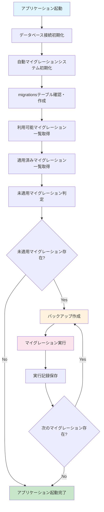
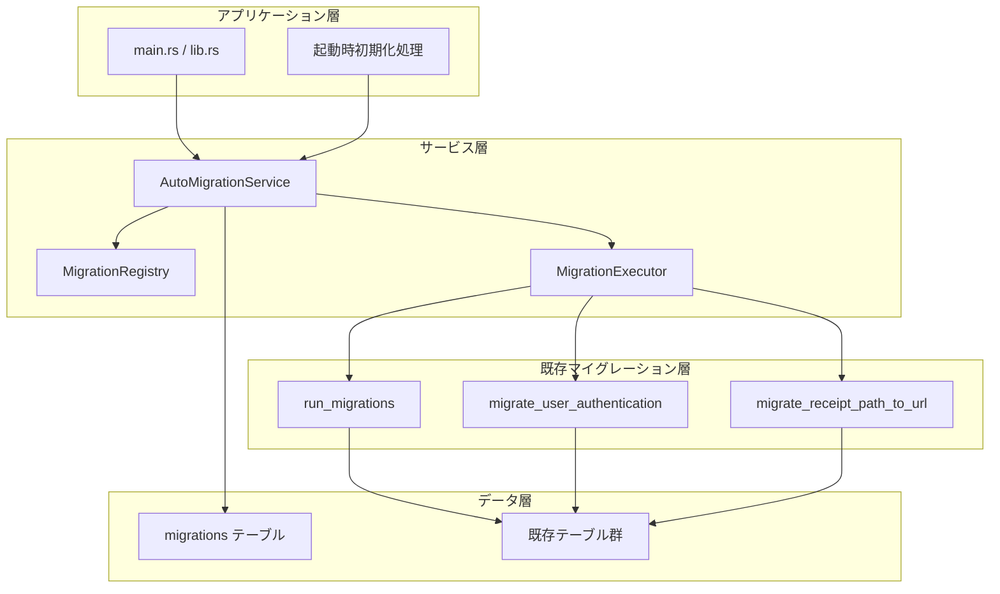

# 設計書

## 概要

アプリケーション起動時に実行されていないマイグレーションを自動で適用するシステムを設計します。`migrations`テーブルを使用してマイグレーション実行履歴を管理し、既存のマイグレーション機能と統合して、安全で効率的な自動マイグレーション機能を提供します。

## アーキテクチャ

### システム構成図



### レイヤー構成



## コンポーネントと インターフェース

### 1. AutoMigrationService

メインの自動マイグレーション管理サービス

```rust
pub struct AutoMigrationService {
    registry: MigrationRegistry,
    executor: MigrationExecutor,
}

impl AutoMigrationService {
    /// 自動マイグレーションシステムを初期化
    pub fn new(conn: &Connection) -> Result<Self, AppError>;
    
    /// アプリケーション起動時の自動マイグレーション実行
    pub fn run_startup_migrations(&self, conn: &Connection) -> Result<AutoMigrationResult, AppError>;
    
    /// マイグレーション状態の確認
    pub fn check_migration_status(&self, conn: &Connection) -> Result<MigrationStatusReport, AppError>;
}
```

### 2. MigrationRegistry

利用可能なマイグレーションの登録と管理

```rust
pub struct MigrationRegistry {
    migrations: Vec<MigrationDefinition>,
}

pub struct MigrationDefinition {
    pub name: String,
    pub version: String,
    pub description: String,
    pub checksum: String,
    pub executor: Box<dyn MigrationExecutorTrait>,
}

impl MigrationRegistry {
    /// 新しいレジストリを作成
    pub fn new() -> Self;
    
    /// 利用可能なマイグレーション一覧を取得
    pub fn get_available_migrations(&self) -> &[MigrationDefinition];
    
    /// マイグレーション定義を名前で検索
    pub fn find_migration(&self, name: &str) -> Option<&MigrationDefinition>;
}
```

### 3. MigrationExecutor

マイグレーションの実行とトランザクション管理

```rust
pub struct MigrationExecutor;

impl MigrationExecutor {
    /// マイグレーションを安全に実行
    pub fn execute_migration(
        &self,
        conn: &Connection,
        migration: &MigrationDefinition,
    ) -> Result<MigrationExecutionResult, AppError>;
    
    /// バックアップを作成
    pub fn create_backup(&self, conn: &Connection) -> Result<String, AppError>;
}
```

### 4. MigrationTable

migrationsテーブルの管理

```rust
pub struct MigrationTable;

impl MigrationTable {
    /// migrationsテーブルを初期化
    pub fn initialize(conn: &Connection) -> Result<(), AppError>;
    
    /// 適用済みマイグレーション一覧を取得
    pub fn get_applied_migrations(conn: &Connection) -> Result<Vec<AppliedMigration>, AppError>;
    
    /// マイグレーション実行記録を保存
    pub fn record_migration(
        conn: &Connection,
        migration: &MigrationDefinition,
        applied_at: &str,
    ) -> Result<(), AppError>;
    
    /// マイグレーションが適用済みかチェック
    pub fn is_migration_applied(conn: &Connection, name: &str) -> Result<bool, AppError>;
}
```

## データモデル

### migrationsテーブル

```sql
CREATE TABLE migrations (
    id INTEGER PRIMARY KEY AUTOINCREMENT,
    name TEXT NOT NULL UNIQUE,
    version TEXT NOT NULL,
    description TEXT,
    checksum TEXT NOT NULL,
    applied_at TEXT NOT NULL,
    execution_time_ms INTEGER,
    created_at TEXT NOT NULL DEFAULT CURRENT_TIMESTAMP
);

CREATE INDEX idx_migrations_name ON migrations(name);
CREATE INDEX idx_migrations_applied_at ON migrations(applied_at);
CREATE INDEX idx_migrations_version ON migrations(version);
```

### データ構造

```rust
#[derive(Debug, Serialize, Deserialize)]
pub struct AppliedMigration {
    pub id: i64,
    pub name: String,
    pub version: String,
    pub description: Option<String>,
    pub checksum: String,
    pub applied_at: String,
    pub execution_time_ms: Option<i64>,
    pub created_at: String,
}

#[derive(Debug, Serialize, Deserialize)]
pub struct AutoMigrationResult {
    pub success: bool,
    pub message: String,
    pub applied_migrations: Vec<String>,
    pub backup_path: Option<String>,
    pub total_execution_time_ms: i64,
}

#[derive(Debug, Serialize, Deserialize)]
pub struct MigrationStatusReport {
    pub total_available: usize,
    pub total_applied: usize,
    pub pending_migrations: Vec<String>,
    pub last_migration_date: Option<String>,
    pub database_version: String,
}

#[derive(Debug, Serialize, Deserialize)]
pub struct MigrationExecutionResult {
    pub success: bool,
    pub message: String,
    pub execution_time_ms: i64,
    pub backup_path: Option<String>,
}
```

## 正確性プロパティ

*プロパティとは、システムのすべての有効な実行において成り立つべき特性や動作の形式的な記述です。これらのプロパティは、人間が読める仕様と機械で検証可能な正確性保証の橋渡しをします。*

### プロパティ反映

プロパティの冗長性を排除し、各プロパティが独自の検証価値を提供するように整理しました：

- **テーブル管理プロパティ（1.1-1.4）**: migrationsテーブルの作成と管理の正確性
- **状態判定プロパティ（2.1-2.4）**: マイグレーション状態の正確な判定
- **実行制御プロパティ（3.1-3.5）**: マイグレーション実行の順序と安全性
- **記録管理プロパティ（4.1-4.4）**: 実行記録の完全性と整合性
- **統合プロパティ（5.1-5.4）**: 既存機能との適切な統合
- **エラーハンドリングプロパティ（6.1-6.4）**: 失敗時の適切な処理
- **状態確認プロパティ（7.1-7.4）**: 状態確認機能の正確性
- **パフォーマンスプロパティ（8.1-8.4）**: 効率性と並行制御

### 正確性プロパティ一覧

**プロパティ 1: migrationsテーブル自動作成**
*任意の* データベース状態でアプリケーションを起動したとき、migrationsテーブルが存在しない場合は適切な構造で作成される
**検証: 要件 1.1, 1.2, 1.3**

**プロパティ 2: migrationsテーブル冪等性**
*任意の* 既存migrationsテーブルがある状態で初期化を実行したとき、テーブル構造が変更されずに処理が継続される
**検証: 要件 1.4**

**プロパティ 3: マイグレーション状態判定の正確性**
*任意の* データベース状態において、利用可能なマイグレーションから適用済みマイグレーションを除いた結果が未適用マイグレーション一覧として正しく返される
**検証: 要件 2.1, 2.2, 2.3**

**プロパティ 4: マイグレーション名重複検出**
*任意の* マイグレーション定義において、重複したマイグレーション名が存在する場合はエラーが返される
**検証: 要件 2.4**

**プロパティ 5: マイグレーション実行順序**
*任意の* 未適用マイグレーション集合において、データベース接続確立後にマイグレーションが順次実行される
**検証: 要件 3.1, 3.2**

**プロパティ 6: マイグレーション実行時バックアップ作成**
*任意の* マイグレーション実行において、実行前にバックアップが作成される
**検証: 要件 3.3**

**プロパティ 7: マイグレーション成功時記録保存**
*任意の* 成功したマイグレーションにおいて、migrationsテーブルに実行記録が追加される
**検証: 要件 3.4**

**プロパティ 8: マイグレーション失敗時処理**
*任意の* 失敗したマイグレーションにおいて、エラーログが出力され、アプリケーション起動が停止される
**検証: 要件 3.5**

**プロパティ 9: マイグレーション記録完全性**
*任意の* マイグレーション実行において、マイグレーション名、JST実行日時、チェックサムが記録に含まれる
**検証: 要件 4.1, 4.2, 4.3**

**プロパティ 10: チェックサム整合性検証**
*任意の* 同じマイグレーション名で異なるチェックサムが検出された場合、エラーが返される
**検証: 要件 4.4**

**プロパティ 11: 既存マイグレーション機能統合**
*任意の* 自動マイグレーション初期化において、既存のマイグレーション関数が適切な条件で呼び出される
**検証: 要件 5.1, 5.2, 5.3, 5.4**

**プロパティ 12: マイグレーションエラー時トランザクション管理**
*任意の* マイグレーション実行エラーにおいて、トランザクションがロールバックされ、詳細なエラー情報が提供される
**検証: 要件 6.1, 6.2, 6.3, 6.4**

**プロパティ 13: マイグレーション状態確認出力完全性**
*任意の* マイグレーション状態確認において、適用済み・未適用マイグレーション一覧、実行日時、整合性状態が表示される
**検証: 要件 7.1, 7.2, 7.3, 7.4**

**プロパティ 14: マイグレーション処理効率性**
*任意の* マイグレーション状態チェックにおいて、必要最小限のクエリでインデックスを活用した高速処理が実行される
**検証: 要件 8.1, 8.2**

**プロパティ 15: 並行実行制御**
*任意の* 複数アプリケーションインスタンス起動において、データベースロックが適切に管理され、重複実行が防止される
**検証: 要件 8.3, 8.4**

## エラーハンドリング

### エラー分類

1. **初期化エラー**
   - migrationsテーブル作成失敗
   - データベース接続エラー
   - 権限不足エラー

2. **マイグレーション実行エラー**
   - マイグレーション関数実行失敗
   - トランザクションエラー
   - チェックサム不一致エラー

3. **並行制御エラー**
   - データベースロック取得失敗
   - 重複実行検出エラー

4. **システムエラー**
   - バックアップ作成失敗
   - ディスク容量不足
   - ファイルシステムエラー

### エラー処理戦略

```rust
pub enum MigrationError {
    InitializationError(String),
    ExecutionError { migration_name: String, cause: String },
    ConcurrencyError(String),
    SystemError(String),
    ChecksumMismatch { migration_name: String, expected: String, actual: String },
}

impl MigrationError {
    pub fn is_recoverable(&self) -> bool {
        match self {
            MigrationError::ConcurrencyError(_) => true,
            MigrationError::SystemError(_) => true,
            _ => false,
        }
    }
    
    pub fn should_stop_startup(&self) -> bool {
        match self {
            MigrationError::ChecksumMismatch { .. } => true,
            MigrationError::ExecutionError { .. } => true,
            _ => false,
        }
    }
}
```

## テスト戦略

### 二重テストアプローチ

**ユニットテスト**: 特定の例、エッジケース、エラー条件の検証
- migrationsテーブル作成の具体例
- 特定のマイグレーション実行シナリオ
- エラー条件の具体的なケース

**プロパティテスト**: 全入力にわたる普遍的プロパティの検証
- 任意のデータベース状態でのテーブル作成
- 任意のマイグレーション集合での状態判定
- 任意のエラー条件での適切な処理

### プロパティテスト設定

- **最小実行回数**: 各プロパティテスト100回
- **テストタグ形式**: **Feature: automatic-migration-system, Property {number}: {property_text}**
- **テストライブラリ**: `proptest` (Rust用プロパティベーステストライブラリ)

### テストデータ生成戦略

```rust
// マイグレーション定義生成
prop_compose! {
    fn arb_migration_definition()
        (name in "[a-z_]{5,20}",
         version in "\\d+\\.\\d+\\.\\d+",
         description in ".*",
         checksum in "[a-f0-9]{32}")
        -> MigrationDefinition {
        MigrationDefinition {
            name,
            version,
            description,
            checksum,
            executor: Box::new(MockMigrationExecutor),
        }
    }
}

// データベース状態生成
prop_compose! {
    fn arb_database_state()
        (has_migrations_table: bool,
         applied_migrations: Vec<String>)
        -> DatabaseState {
        DatabaseState {
            has_migrations_table,
            applied_migrations,
        }
    }
}
```

## 実装詳細

### 起動時統合ポイント

現在の`src-tauri/src/shared/database/connection.rs`の`initialize_database`関数に統合：

```rust
pub fn initialize_database(app_handle: &AppHandle) -> AppResult<Connection> {
    let database_path = get_database_path(app_handle)?;
    let conn = Connection::open(&database_path)?;
    
    // 既存のテーブル作成
    create_tables(&conn)?;
    
    // 新機能: 自動マイグレーションシステム初期化
    let auto_migration_service = AutoMigrationService::new(&conn)?;
    auto_migration_service.run_startup_migrations(&conn)?;
    
    Ok(conn)
}
```

### マイグレーション定義の登録

```rust
impl MigrationRegistry {
    pub fn register_default_migrations() -> Self {
        let mut registry = Self::new();
        
        // 基本スキーママイグレーション
        registry.register(MigrationDefinition {
            name: "001_create_basic_schema".to_string(),
            version: "1.0.0".to_string(),
            description: "基本テーブル構造の作成".to_string(),
            checksum: calculate_checksum("run_migrations"),
            executor: Box::new(BasicSchemaMigrationExecutor),
        });
        
        // ユーザー認証マイグレーション
        registry.register(MigrationDefinition {
            name: "002_add_user_authentication".to_string(),
            version: "2.0.0".to_string(),
            description: "ユーザー認証機能の追加".to_string(),
            checksum: calculate_checksum("migrate_user_authentication"),
            executor: Box::new(UserAuthMigrationExecutor),
        });
        
        // receipt_urlマイグレーション
        registry.register(MigrationDefinition {
            name: "003_migrate_receipt_url".to_string(),
            version: "2.1.0".to_string(),
            description: "receipt_pathからreceipt_urlへの移行".to_string(),
            checksum: calculate_checksum("migrate_receipt_path_to_url"),
            executor: Box::new(ReceiptUrlMigrationExecutor),
        });
        
        registry
    }
}
```

### チェックサム計算

```rust
pub fn calculate_checksum(content: &str) -> String {
    use sha2::{Sha256, Digest};
    let mut hasher = Sha256::new();
    hasher.update(content.as_bytes());
    format!("{:x}", hasher.finalize())
}
```

### 並行制御実装

```rust
impl AutoMigrationService {
    pub fn run_startup_migrations(&self, conn: &Connection) -> Result<AutoMigrationResult, AppError> {
        // データベースレベルでの排他制御
        conn.execute("BEGIN EXCLUSIVE TRANSACTION", [])?;
        
        // アプリケーションレベルでの重複実行チェック
        if self.is_migration_in_progress(conn)? {
            conn.execute("ROLLBACK", [])?;
            return Err(MigrationError::ConcurrencyError(
                "別のインスタンスがマイグレーション実行中です".to_string()
            ).into());
        }
        
        // マイグレーション実行フラグを設定
        self.set_migration_in_progress(conn, true)?;
        
        let result = self.execute_pending_migrations(conn);
        
        // 実行フラグをクリア
        self.set_migration_in_progress(conn, false)?;
        
        match result {
            Ok(migration_result) => {
                conn.execute("COMMIT", [])?;
                Ok(migration_result)
            }
            Err(e) => {
                conn.execute("ROLLBACK", [])?;
                Err(e)
            }
        }
    }
}
```

### パフォーマンス最適化

1. **インデックス活用**
   - `migrations.name`にユニークインデックス
   - `migrations.applied_at`に範囲検索用インデックス

2. **クエリ最適化**
   - 単一クエリでの未適用マイグレーション判定
   - バッチ処理での記録保存

3. **メモリ効率**
   - ストリーミング処理での大量マイグレーション処理
   - 遅延評価での不要な処理回避

### セキュリティ考慮事項

1. **SQLインジェクション防止**
   - パラメータ化クエリの使用
   - 動的SQL生成の回避

2. **権限管理**
   - データベース操作権限の最小化
   - マイグレーション実行権限の制限

3. **監査ログ**
   - 全マイグレーション実行の記録
   - セキュリティイベントの追跡

## 運用考慮事項

### モニタリング

1. **メトリクス収集**
   - マイグレーション実行時間
   - 失敗率とエラー分類
   - データベースサイズ変化

2. **アラート設定**
   - マイグレーション失敗時の即座通知
   - 実行時間異常の検出
   - 並行実行競合の監視

### バックアップ戦略

1. **自動バックアップ**
   - マイグレーション実行前の必須バックアップ
   - 世代管理による古いバックアップの自動削除

2. **復旧手順**
   - マイグレーション失敗時の自動ロールバック
   - 手動復旧のためのバックアップファイル通知

### 開発・テスト環境での考慮事項

1. **環境分離**
   - 開発環境での安全なマイグレーションテスト
   - プロダクション環境への影響回避

2. **テストデータ管理**
   - マイグレーション前後のデータ整合性確認
   - テスト用マイグレーションの分離管理