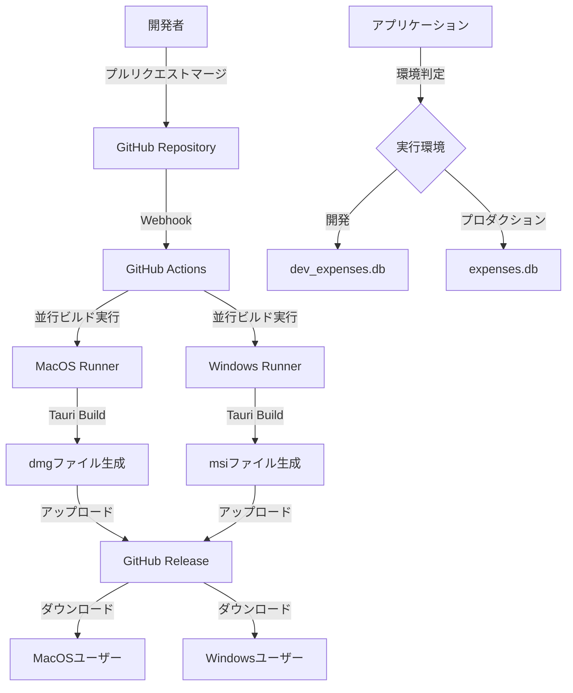

# 設計書

## 概要

GitHubのmainブランチマージ時にMacOS向けdmgファイルとWindows向けmsiファイルを自動生成するクロスプラットフォームCI/CDパイプラインと、開発・プロダクション環境でのデータベース分離機能を設計する。GitHub Actionsを使用してTauriアプリケーションのビルド、パッケージング、リリース配布を自動化し、環境に応じたデータベースファイル管理を実装する。

## アーキテクチャ

### システム構成



### CI/CDパイプライン設計

1. **トリガー**: mainブランチへのプッシュ
2. **ビルド環境**: 
   - GitHub Actions MacOS runner（dmgファイル用）
   - GitHub Actions Windows runner（msiファイル用）
3. **並行ビルドプロセス**: 
   - **MacOS**: 依存関係インストール → フロントエンドビルド（pnpm + SvelteKit） → Tauriアプリケーションビルド → dmgファイル生成
   - **Windows**: 依存関係インストール → フロントエンドビルド（pnpm + SvelteKit） → Tauriアプリケーションビルド → msiファイル生成
4. **成果物管理**: GitHub Releases経由でのクロスプラットフォーム配布

### データベース分離設計

環境変数とビルド設定を使用して、開発環境とプロダクション環境で異なるデータベースファイル名を使用する。

## コンポーネントと インターフェース

### GitHub Actionsワークフロー

**ファイル**: `.github/workflows/release.yml`

**MacOSビルドジョブ**の主要ステップ:
- Node.js環境セットアップ
- Rust環境セットアップ
- pnpm依存関係インストール
- フロントエンドビルド
- Tauriアプリケーションビルド
- dmgファイル生成
- 成果物アップロード

**Windowsビルドジョブ**の主要ステップ:
- Node.js環境セットアップ
- Rust環境セットアップ
- pnpm依存関係インストール
- フロントエンドビルド
- Tauriアプリケーションビルド
- msiファイル生成
- 成果物アップロード

**リリースジョブ**（両ビルド完了後）:
- GitHubリリース作成
- dmgとmsiファイルをアセット添付

### 環境設定管理

**ファイル**: `src-tauri/src/config/environment.rs`

環境判定とデータベースパス決定のロジックを実装:
```rust
pub enum Environment {
    Development,
    Production,
}

pub fn get_environment() -> Environment {
    // ビルド時の環境変数またはデバッグビルドかどうかで判定
}

pub fn get_database_filename(env: Environment) -> &'static str {
    match env {
        Environment::Development => "dev_expenses.db",
        Environment::Production => "expenses.db",
    }
}
```

### ビルド設定更新

**ファイル**: `src-tauri/tauri.conf.json`

プロダクションビルド用の設定を追加:
- バンドル設定の最適化
- アプリケーション識別子の確認
- アイコンとメタデータの設定

## データモデル

### 環境設定

```rust
#[derive(Debug, Clone)]
pub struct AppConfig {
    pub environment: Environment,
    pub database_path: PathBuf,
    pub app_data_dir: PathBuf,
}
```

### ビルド情報

```rust
#[derive(Debug)]
pub struct BuildInfo {
    pub version: String,
    pub build_date: String,
    pub commit_hash: String,
    pub environment: Environment,
}
```

## 正確性プロパティ

*プロパティとは、システムのすべての有効な実行において真であるべき特性や動作のことです。これは、人間が読める仕様と機械で検証可能な正確性保証の橋渡しとなります。*

**プロパティ1: クロスプラットフォーム成果物生成**
*すべての*成功したビルドプロセスに対して、対応するプラットフォーム（MacOS用dmgファイル、Windows用msiファイル）の成果物が生成され、ダウンロード可能な状態でGitHub Actionsの成果物として保存される
**検証対象: 要件 1.2, 1.3, 1.5**

**プロパティ2: ビルド失敗時エラーハンドリング**
*すべての*ビルド失敗に対して、適切なエラーメッセージが表示され、開発者に通知される
**検証対象: 要件 1.4, 5.3**

**プロパティ3: 署名済み実行可能ファイル提供**
*すべての*生成されたインストールファイル（dmgまたはmsi）に対して、署名済みで実行可能なアプリケーションが含まれている
**検証対象: 要件 2.2, 3.2**

**プロパティ4: 初回起動時初期化**
*すべての*プラットフォームでの初回起動に対して、適切なアプリケーションデータディレクトリが作成され、プロダクション用データベースが初期化される
**検証対象: 要件 2.4, 3.4**

**プロパティ5: 環境に応じたデータベースファイル選択**
*すべての*アプリケーション起動に対して、実行環境（開発/プロダクション）に応じて適切なデータベースファイル名が選択される
**検証対象: 要件 4.1, 4.2**

**プロパティ6: 環境切り替え時パス自動選択**
*すべての*環境切り替えに対して、適切なデータベースファイルパスが自動的に選択される
**検証対象: 要件 4.3**

**プロパティ7: データベースファイル自動作成**
*すべての*データベースファイルが存在しない状況に対して、環境に応じた適切な場所に新しいデータベースファイルが作成される
**検証対象: 要件 4.4**

**プロパティ8: 固定依存関係使用**
*すべての*プラットフォームのビルドプロセスに対して、固定されたバージョンの依存関係が使用される
**検証対象: 要件 5.1**

**プロパティ9: ビルド再現性**
*すべての*同じ入力に対して、ビルド環境が変更されても同じ出力が生成される
**検証対象: 要件 5.2**

**プロパティ10: 新コミット時ビルド状態クリア**
*すべての*新しいコミットプッシュに対して、前回のビルド状態がクリアされて新しいビルドが開始される
**検証対象: 要件 5.4**

**プロパティ11: クロスプラットフォーム依存関係管理**
*すべての*複数プラットフォームビルドに対して、各プラットフォーム固有の依存関係が適切に管理される
**検証対象: 要件 5.5**

**プロパティ12: クロスプラットフォームリリースアセット添付**
*すべての*リリース作成に対して、生成されたdmgファイルとmsiファイルの両方がリリースアセットとして添付される
**検証対象: 要件 6.2**

**プロパティ13: リリースノート自動生成**
*すべての*リリースノート生成要求に対して、最新のコミットメッセージから自動的にリリースノートが生成される
**検証対象: 要件 6.3**

**プロパティ14: リリース完了通知**
*すべての*リリースプロセス完了に対して、関係者に通知が送信される
**検証対象: 要件 6.4**

**プロパティ15: ビルド失敗時リリース中止**
*すべての*プラットフォームでのビルド失敗に対して、リリース作成が中止され、エラー詳細が報告される
**検証対象: 要件 6.5**

## エラーハンドリング

### ビルドエラー

- 依存関係インストール失敗
- コンパイルエラー
- パッケージング失敗
- 署名エラー

各エラーに対して適切なログ出力と通知機能を実装する。

### 環境設定エラー

- 無効な環境変数
- データベースファイル作成権限エラー
- アプリケーションデータディレクトリアクセスエラー

フォールバック機能と詳細なエラーメッセージを提供する。

### GitHub Actions エラー

- ランナー環境エラー
- 認証エラー
- リリース作成エラー

リトライ機能と適切なエラー報告を実装する。

## テスト戦略

### 単体テスト

- 環境判定ロジックのテスト
- データベースパス生成のテスト
- 設定ファイル読み込みのテスト

### プロパティベーステスト

プロパティベーステストには**fast-check**（TypeScript/JavaScript）と**proptest**（Rust）を使用する。各プロパティベーステストは最低100回の反復実行を行う。

各プロパティベーステストには、設計書の正確性プロパティを参照するコメントを以下の形式で付与する：
`**Feature: cicd-macos-build, Property {番号}: {プロパティテキスト}**`

### 統合テスト

- GitHub Actionsワークフローのテスト
- エンドツーエンドビルドプロセスのテスト
- リリース作成プロセスのテスト

### 手動テスト

- dmgファイルのインストールテスト（MacOS）
- msiファイルのインストールテスト（Windows）
- MacOS環境での動作確認
- Windows環境での動作確認
- 署名検証テスト（両プラットフォーム）