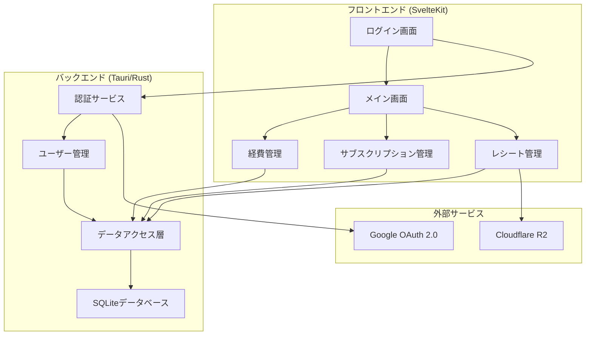
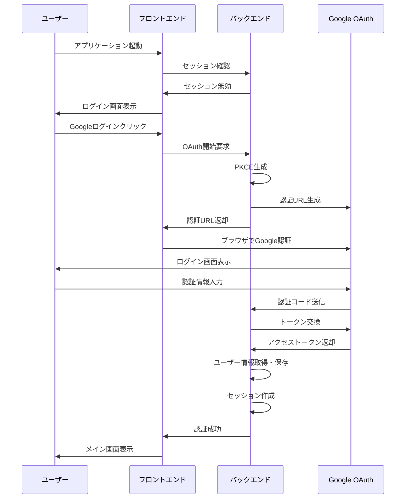

# 設計書

## 概要

既存の個人用経費・サブスクリプション管理アプリケーションにGoogleログイン機能を追加し、複数ユーザーが利用できるマルチテナント対応を実現する。各ユーザーは自分のデータのみにアクセスでき、セキュアな認証とセッション管理を提供する。

## アーキテクチャ

### 全体構成



### 認証フロー



## コンポーネントと インターフェース

### 1. 認証サービス (Rust)

#### AuthService
```rust
pub struct AuthService {
    oauth_client: OAuth2Client,
    session_manager: SessionManager,
    user_repository: UserRepository,
}

impl AuthService {
    /// OAuth認証フローを開始する
    pub async fn start_oauth_flow(&self) -> Result<AuthUrl, AuthError>;
    
    /// 認証コールバックを処理する
    pub async fn handle_callback(&self, code: String, state: String) -> Result<User, AuthError>;
    
    /// セッションを検証する
    pub async fn validate_session(&self, token: String) -> Result<User, AuthError>;
    
    /// ログアウト処理
    pub async fn logout(&self, session_id: String) -> Result<(), AuthError>;
}
```

#### SessionManager
```rust
pub struct SessionManager {
    encryption_key: Vec<u8>,
}

impl SessionManager {
    /// セッションを作成する
    pub fn create_session(&self, user_id: i64) -> Result<Session, SessionError>;
    
    /// セッションを検証する
    pub fn validate_session(&self, token: String) -> Result<Session, SessionError>;
    
    /// セッションを無効化する
    pub fn invalidate_session(&self, session_id: String) -> Result<(), SessionError>;
}
```

### 2. ユーザー管理 (Rust)

#### UserRepository
```rust
pub struct UserRepository {
    db_connection: Arc<Mutex<Connection>>,
}

impl UserRepository {
    /// Googleユーザー情報からユーザーを作成または取得
    pub async fn find_or_create_user(&self, google_user: GoogleUser) -> Result<User, DatabaseError>;
    
    /// ユーザーIDでユーザーを取得
    pub async fn get_user_by_id(&self, user_id: i64) -> Result<Option<User>, DatabaseError>;
    
    /// GoogleIDでユーザーを取得
    pub async fn get_user_by_google_id(&self, google_id: String) -> Result<Option<User>, DatabaseError>;
}
```

### 3. フロントエンド認証 (SvelteKit)

#### AuthStore
```typescript
interface AuthState {
    user: User | null;
    isAuthenticated: boolean;
    isLoading: boolean;
}

class AuthStore {
    /// ログイン処理を開始
    async login(): Promise<void>;
    
    /// ログアウト処理
    async logout(): Promise<void>;
    
    /// セッション状態を確認
    async checkSession(): Promise<void>;
    
    /// 認証状態を監視
    subscribe(callback: (state: AuthState) => void): () => void;
}
```

#### AuthGuard
```typescript
/// 認証が必要なページを保護するガード
export function requireAuth(load: PageLoad): PageLoad {
    return async (event) => {
        const authState = get(authStore);
        if (!authState.isAuthenticated) {
            throw redirect(302, '/login');
        }
        return load(event);
    };
}
```

## データモデル

### 1. ユーザーテーブル (新規)

```sql
CREATE TABLE users (
    id INTEGER PRIMARY KEY AUTOINCREMENT,
    google_id TEXT NOT NULL UNIQUE,
    email TEXT NOT NULL,
    name TEXT NOT NULL,
    picture_url TEXT,
    created_at TEXT NOT NULL,
    updated_at TEXT NOT NULL
);

CREATE INDEX idx_users_google_id ON users(google_id);
CREATE INDEX idx_users_email ON users(email);
```

### 2. セッションテーブル (新規)

```sql
CREATE TABLE sessions (
    id TEXT PRIMARY KEY,
    user_id INTEGER NOT NULL,
    expires_at TEXT NOT NULL,
    created_at TEXT NOT NULL,
    FOREIGN KEY (user_id) REFERENCES users(id) ON DELETE CASCADE
);

CREATE INDEX idx_sessions_user_id ON sessions(user_id);
CREATE INDEX idx_sessions_expires_at ON sessions(expires_at);
```

### 3. 既存テーブルの拡張

#### 経費テーブル
```sql
-- user_idカラムを追加
ALTER TABLE expenses ADD COLUMN user_id INTEGER REFERENCES users(id);

-- 既存データにデフォルトユーザーIDを設定
UPDATE expenses SET user_id = 1 WHERE user_id IS NULL;

-- NOT NULL制約を追加
-- （SQLiteでは直接追加できないため、テーブル再作成が必要）

CREATE INDEX idx_expenses_user_id ON expenses(user_id);
```

#### サブスクリプションテーブル
```sql
-- user_idカラムを追加
ALTER TABLE subscriptions ADD COLUMN user_id INTEGER REFERENCES users(id);

-- 既存データにデフォルトユーザーIDを設定
UPDATE subscriptions SET user_id = 1 WHERE user_id IS NULL;

CREATE INDEX idx_subscriptions_user_id ON subscriptions(user_id);
```

#### レシートキャッシュテーブル
```sql
-- user_idカラムを追加
ALTER TABLE receipt_cache ADD COLUMN user_id INTEGER REFERENCES users(id);

-- 既存データにデフォルトユーザーIDを設定
UPDATE receipt_cache SET user_id = 1 WHERE user_id IS NULL;

CREATE INDEX idx_receipt_cache_user_id ON receipt_cache(user_id);
```

## 正当性プロパティ

*プロパティとは、システムのすべての有効な実行において真であるべき特性や動作のことです。これらは人間が読める仕様と機械で検証可能な正当性保証の橋渡しをします。*

### プロパティ1: 認証フロー開始
*すべての* Googleログインボタンクリックに対して、システムは認証フローを開始する必要がある
**検証対象: 要件 1.2**

### プロパティ2: 認証完了時のセッション作成
*すべての* 成功した認証に対して、システムはユーザー情報を取得してセッションを作成する必要がある
**検証対象: 要件 1.3**

### プロパティ3: 認証失敗時のエラー処理
*すべての* 認証失敗に対して、システムはエラーメッセージを表示してログイン画面に戻る必要がある
**検証対象: 要件 1.4**

### プロパティ4: 既存セッションの自動ログイン
*すべての* 有効なセッションを持つユーザーに対して、システムは自動的にメイン画面に遷移する必要がある
**検証対象: 要件 1.5**

### プロパティ5: ユーザーデータの分離
*すべての* ログイン済みユーザーに対して、システムはそのユーザーのデータのみを表示する必要がある
**検証対象: 要件 2.1**

### プロパティ6: データ作成時の所有権設定
*すべての* データ作成操作（経費、サブスクリプション、レシート）に対して、システムはそのデータをログイン中のユーザーに紐づけて保存する必要がある
**検証対象: 要件 2.2, 2.3, 2.4**

### プロパティ7: データアクセス制御
*すべての* データベースクエリとユーザーデータアクセスに対して、システムは認証済みユーザーのデータのみを返し、常にユーザーIDでフィルタリングする必要がある
**検証対象: 要件 2.5, 6.4**

### プロパティ8: セッションの安全な管理
*すべての* セッション作成と保存に対して、システムはセッションを暗号化して安全に保存する必要がある
**検証対象: 要件 3.1, 3.5**

### プロパティ9: セッション永続化
*すべての* アプリケーション再起動に対して、システムは有効なセッションがあれば自動ログインを実行する必要がある
**検証対象: 要件 3.2**

### プロパティ10: セッション期限管理
*すべての* 期限切れセッションに対して、システムはユーザーをログイン画面にリダイレクトする必要がある
**検証対象: 要件 3.3**

### プロパティ11: ログアウト処理
*すべての* ログアウト操作に対して、システムはセッションを削除してログイン画面に戻る必要がある
**検証対象: 要件 3.4**

### プロパティ12: 既存データのデフォルトユーザー割り当て
*すべての* 既存データ（経費、サブスクリプション、レシート）に対して、システムはデフォルトユーザーとして扱う必要がある
**検証対象: 要件 7.1, 7.2, 7.3**

### プロパティ13: 外部キー制約の適用
*すべての* データベースクエリに対して、システムは外部キー制約を適切に設定する必要がある
**検証対象: 要件 4.4**

### プロパティ14: マイグレーション失敗時のロールバック
*すべての* マイグレーション失敗に対して、システムはデータベースを元の状態にロールバックする必要がある
**検証対象: 要件 4.5**

### プロパティ15: UIコンポーネントの表示
*すべての* メイン画面表示に対して、システムはユーザー名とログアウトボタンをヘッダーに表示する必要がある
**検証対象: 要件 5.2**

### プロパティ16: ローディング状態の表示
*すべての* ログイン処理中に対して、システムはローディング表示を行う必要がある
**検証対象: 要件 5.3**

### プロパティ17: エラーメッセージの表示
*すべての* 認証エラーに対して、システムはエラーメッセージを表示する必要がある
**検証対象: 要件 5.4**

### プロパティ18: ログアウト確認ダイアログ
*すべての* ログアウト操作に対して、システムは確認ダイアログを表示する必要がある
**検証対象: 要件 5.5**

### プロパティ19: 認証トークンの暗号化
*すべての* 認証トークン保存に対して、システは暗号化して保存する必要がある
**検証対象: 要件 6.1**

### プロパティ20: APIリクエストの認証
*すべての* APIリクエストに対して、システムは有効な認証トークンを含める必要がある
**検証対象: 要件 6.2**

### プロパティ21: 不正アクセスの処理
*すべての* 不正アクセス検出に対して、システムはアクセスを拒否してログを記録する必要がある
**検証対象: 要件 6.3**

### プロパティ22: データ移行時のバックアップ
*すべての* データ移行実行に対して、システムはバックアップを作成してから実行する必要がある
**検証対象: 要件 7.5**

## エラーハンドリング

### 認証エラー
- **OAuth認証失敗**: Google認証サーバーからのエラーレスポンスを適切に処理し、ユーザーにわかりやすいメッセージを表示
- **トークン期限切れ**: アクセストークンの期限切れを検出し、自動的にリフレッシュまたは再認証を促す
- **ネットワークエラー**: 認証プロセス中のネットワーク問題を検出し、適切なリトライ機能を提供

### セッション管理エラー
- **セッション破損**: 暗号化されたセッションデータの復号化に失敗した場合の処理
- **セッション期限切れ**: 期限切れセッションの検出と自動ログアウト処理
- **同時セッション**: 複数デバイスでの同時ログイン時の競合状態の処理

### データベースエラー
- **マイグレーション失敗**: データベーススキーマ変更時のロールバック機能
- **制約違反**: 外部キー制約やユニーク制約違反時の適切なエラーメッセージ
- **データ整合性**: ユーザーデータの整合性チェックと修復機能

## テスト戦略

### 二重テストアプローチ
- **ユニットテスト**: 特定の例、エッジケース、エラー条件を検証
- **プロパティテスト**: すべての入力に対する普遍的なプロパティを検証
- 両方のテストは相補的であり、包括的なカバレッジに必要

### プロパティベーステスト設定
- **最小実行回数**: プロパティテストごとに100回の反復実行
- **テストライブラリ**: Rustでは`proptest`、TypeScriptでは`fast-check`を使用
- **タグ形式**: **機能: google-authentication, プロパティ {番号}: {プロパティテキスト}**

### テスト範囲
- **認証フロー**: OAuth認証の各ステップとエラーケース
- **セッション管理**: セッション作成、検証、期限切れ処理
- **データアクセス制御**: ユーザーデータの分離と権限チェック
- **UI統合**: 認証状態に応じたUI表示とナビゲーション
- **データベースマイグレーション**: スキーマ変更と既存データの処理