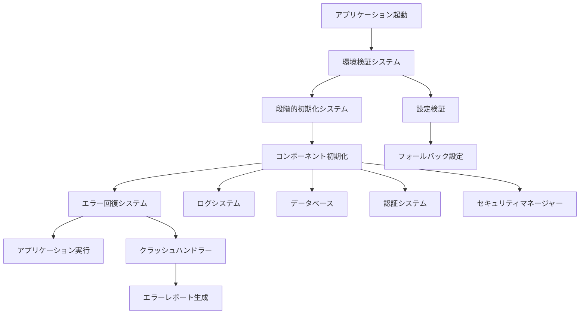

# 設計書

## 概要

プロダクションビルド（DMG）でのアプリケーションクラッシュを解決し、安定したプロダクション環境での動作を実現するシステムの設計です。段階的初期化、包括的なエラーハンドリング、フォールバック機能を実装し、部分的な障害があってもアプリケーションが継続動作できるようにします。

## アーキテクチャ

### システム構成



### レイヤー構造

1. **初期化レイヤー**: 環境検証と段階的初期化
2. **コンポーネントレイヤー**: 各機能モジュールの初期化
3. **エラー処理レイヤー**: エラー検出と回復処理
4. **ログ・監視レイヤー**: デバッグ情報の収集と出力

## コンポーネントとインターフェース

### 1. 環境検証システム (EnvironmentValidator)

```rust
pub struct EnvironmentValidator {
    validation_results: HashMap<String, ValidationResult>,
    fallback_configs: HashMap<String, Box<dyn FallbackConfig>>,
}

impl EnvironmentValidator {
    pub fn validate_all_configurations() -> ValidationReport;
    pub fn apply_fallback_if_needed(config_name: &str) -> Result<(), ValidationError>;
    pub fn get_validation_summary() -> ValidationSummary;
}
```

### 2. 段階的初期化システム (StageInitializer)

```rust
pub struct StageInitializer {
    stages: Vec<InitializationStage>,
    current_stage: usize,
    failed_components: HashSet<String>,
}

impl StageInitializer {
    pub fn initialize_stage(&mut self, stage: InitializationStage) -> StageResult;
    pub fn handle_stage_failure(&mut self, error: InitializationError) -> RecoveryAction;
    pub fn can_continue_without_component(&self, component: &str) -> bool;
}
```

### 3. エラー回復システム (ErrorRecoverySystem)

```rust
pub struct ErrorRecoverySystem {
    recovery_strategies: HashMap<ErrorType, RecoveryStrategy>,
    fallback_modes: Vec<FallbackMode>,
}

impl ErrorRecoverySystem {
    pub fn handle_initialization_error(&self, error: InitializationError) -> RecoveryAction;
    pub fn enable_fallback_mode(&self, mode: FallbackMode) -> Result<(), RecoveryError>;
    pub fn generate_crash_report(&self, crash_info: CrashInfo) -> CrashReport;
}
```

### 4. プロダクション設定マネージャー (ProductionConfigManager)

```rust
pub struct ProductionConfigManager {
    embedded_configs: HashMap<String, String>,
    runtime_configs: HashMap<String, String>,
    default_configs: HashMap<String, String>,
}

impl ProductionConfigManager {
    pub fn get_config_with_fallback(&self, key: &str) -> Option<String>;
    pub fn validate_config_completeness(&self) -> ConfigValidationResult;
    pub fn apply_safe_defaults(&mut self) -> Result<(), ConfigError>;
}
```

## データモデル

### 初期化ステージ

```rust
#[derive(Debug, Clone)]
pub enum InitializationStage {
    EnvironmentValidation,
    LoggingSystem,
    DatabaseConnection,
    MigrationSystem,
    SecurityManager,
    AuthenticationService,
    ApplicationState,
}

#[derive(Debug)]
pub struct StageResult {
    pub stage: InitializationStage,
    pub success: bool,
    pub error: Option<InitializationError>,
    pub can_continue: bool,
    pub fallback_applied: bool,
}
```

### 検証結果

```rust
#[derive(Debug)]
pub struct ValidationResult {
    pub config_name: String,
    pub is_valid: bool,
    pub error_message: Option<String>,
    pub fallback_available: bool,
    pub severity: ValidationSeverity,
}

#[derive(Debug)]
pub enum ValidationSeverity {
    Critical,    // アプリケーション停止
    Warning,     // フォールバック適用
    Info,        // 情報のみ
}
```

### エラー回復アクション

```rust
#[derive(Debug)]
pub enum RecoveryAction {
    Continue,                           // そのまま継続
    ContinueWithFallback(FallbackMode), // フォールバックモードで継続
    DisableComponent(String),           // コンポーネントを無効化
    SafeShutdown(String),              // 安全にシャットダウン
}

#[derive(Debug)]
pub enum FallbackMode {
    LocalOnly,          // ローカル機能のみ
    NoAuthentication,   // 認証なし
    BasicSecurity,      // 基本セキュリティ
    ReadOnlyMode,       // 読み取り専用
}
```

## 正確性プロパティ

*プロパティは、システムのすべての有効な実行において真であるべき特性や動作の形式的な記述です。これらは人間が読める仕様と機械で検証可能な正確性保証の橋渡しとなります。*

### プロパティ 1: 段階的初期化の完全性
*すべての* プロダクションビルドにおいて、初期化処理が開始されたとき、各コンポーネントが段階的に初期化され、初期化が正常に完了するか、適切なフォールバック処理が実行される
**検証対象: 要件 1.1, 4.1**

### プロパティ 2: 包括的フォールバック処理
*すべての* 設定エラーまたはコンポーネント初期化失敗において、システムは適切なフォールバック処理を実行し、可能な限り動作を継続する
**検証対象: 要件 1.2, 1.4, 4.2, 4.3, 4.4**

### プロパティ 3: 包括的エラーハンドリング
*すべての* エラー発生において、システムは詳細なエラー情報をログ出力し、適切な回復アクションを実行する
**検証対象: 要件 1.3, 3.2**

### プロパティ 4: 設定検証と自動修復
*すべての* アプリケーション起動において、環境設定が検証され、無効な設定に対して自動修復またはフォールバック処理が適用される
**検証対象: 要件 2.1, 2.2, 2.3, 2.4**

### プロパティ 5: デバッグ情報の完全性
*すべての* アプリケーション実行において、初期化プロセスと設定検証の詳細ログが出力され、クラッシュ時にはクラッシュレポートが生成される
**検証対象: 要件 3.1, 3.3, 3.4**

### プロパティ 6: 設定優先度の一貫性
*すべての* 設定読み込みにおいて、埋め込み設定、実行時設定、デフォルト設定の優先度が一貫して適用され、最終的に有効な設定が取得される
**検証対象: 要件 5.1, 5.2, 5.3, 5.4**

## エラーハンドリング

### エラー分類と対応

1. **致命的エラー**: アプリケーション継続不可能
   - 対応: 安全なシャットダウンとクラッシュレポート生成

2. **重要エラー**: 主要機能に影響
   - 対応: フォールバックモードでの継続動作

3. **警告レベル**: 一部機能に影響
   - 対応: 機能無効化と警告ログ出力

4. **情報レベル**: 動作に影響なし
   - 対応: 情報ログ出力のみ

### 回復戦略

```rust
pub enum RecoveryStrategy {
    Retry(u32),                    // 指定回数リトライ
    Fallback(FallbackConfig),      // フォールバック設定適用
    Disable(ComponentId),          // コンポーネント無効化
    SafeShutdown(ShutdownReason),  // 安全なシャットダウン
}
```

## テスト戦略

### 単体テスト
- 各コンポーネントの初期化処理
- 設定検証ロジック
- エラーハンドリング機能
- フォールバック処理

### プロパティベーステスト
- 初期化プロセスの完全性検証（プロパティ1）
- フォールバック処理の包括性検証（プロパティ2）
- エラーハンドリングの一貫性検証（プロパティ3）
- 設定検証の完全性検証（プロパティ4）
- ログ出力の完全性検証（プロパティ5）
- 設定優先度の一貫性検証（プロパティ6）

### 統合テスト
- プロダクションビルドでの実際の起動テスト
- 様々な環境設定でのテスト
- エラー注入テスト
- クラッシュ回復テスト

### テスト設定
- 最低100回の反復実行（ランダム化による）
- 各プロパティテストは設計書のプロパティを参照
- タグ形式: **Feature: production-build-stability, Property {番号}: {プロパティテキスト}**
