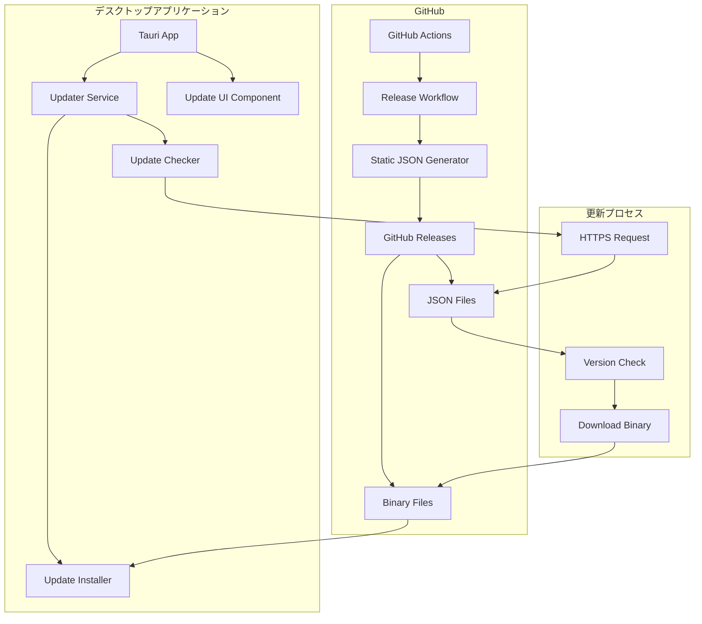

# 設計書

## 概要

Tauri v2のupdaterプラグインを使用して、GitHub Releasesの静的JSONファイルベースの自動アップデート機能を実装する。現在の動的エンドポイント方式から静的JSONファイル方式に変更し、より簡単で信頼性の高いアップデート配信システムを構築する。

## アーキテクチャ

### システム構成図



### データフロー

1. **アプリケーション起動時**
   - Updater Serviceが初期化される
   - 自動アップデートチェックが開始される
   - 静的JSONファイルからアップデート情報を取得

2. **アップデート検出時**
   - Update UI Componentがユーザーに通知
   - ユーザーの承認後、バイナリファイルをダウンロード
   - 署名検証後、インストールを実行

3. **リリース時**
   - GitHub Actionsが静的JSONファイルを生成
   - プラットフォーム・アーキテクチャ別のJSONファイルを作成
   - GitHub Releasesに成果物として配置

## コンポーネントと インターフェース

### 1. Updater Configuration

#### 設定ファイル更新
```json
{
  "plugins": {
    "updater": {
      "active": true,
      "endpoints": [
        "https://github.com/tsucchinoko/orano-keihi/releases/latest/download/{{target}}-{{arch}}.json"
      ],
      "dialog": true,
      "pubkey": "dW50cnVzdGVkIGNvbW1lbnQ6IG1pbmlzaWduIHB1YmxpYyBrZXk6IDE5ODgyMzVBQzk2QTA4QkIKUldTN0NHckpXaU9JR2RwZ0pIUVIwbTE2WGF0ei9CWVRvejdLTnRlclV0ZmlzdUluNmhpbDdTUHEK"
    }
  }
}
```

### 2. Static JSON File Generator

#### JSONファイル構造
```typescript
interface UpdateManifest {
  version: string;
  notes: string;
  pub_date: string;
  platforms: {
    [key: string]: {
      signature: string;
      url: string;
    }
  }
}
```

#### 生成されるファイル例
- `darwin-x86_64.json` - macOS Intel
- `darwin-aarch64.json` - macOS Apple Silicon  
- `windows-x86_64.json` - Windows 64bit

### 3. Enhanced Updater Service

#### Rust実装
```rust
pub struct UpdaterService {
    app_handle: AppHandle,
    config: UpdaterConfig,
}

pub struct UpdaterConfig {
    pub auto_check_enabled: bool,
    pub check_interval_hours: u64,
    pub include_prereleases: bool,
    pub skipped_versions: Vec<String>,
}

impl UpdaterService {
    pub async fn check_for_updates(&self) -> Result<UpdateInfo, UpdateError>;
    pub async fn download_and_install(&self) -> Result<(), UpdateError>;
    pub async fn get_config(&self) -> UpdaterConfig;
    pub async fn update_config(&self, config: UpdaterConfig) -> Result<(), UpdateError>;
    pub fn start_auto_check(&self);
    pub fn stop_auto_check(&self);
}
```

### 4. Update UI Component

#### TypeScript実装
```typescript
interface UpdateNotificationProps {
  updateInfo?: UpdateInfo;
  onInstall: () => Promise<void>;
  onLater: () => void;
  onSkip: (version: string) => void;
}

class UpdaterService {
  static async checkForUpdates(): Promise<UpdateInfo>;
  static async downloadAndInstall(): Promise<void>;
  static async getConfig(): Promise<UpdaterConfig>;
  static async updateConfig(config: UpdaterConfig): Promise<void>;
  static async listenForUpdates(callback: (info: UpdateInfo) => void): Promise<() => void>;
}
```

### 5. GitHub Actions Integration

#### ワークフロー拡張
```yaml
- name: Generate Static JSON Files
  run: |
    node scripts/generate-update-manifest.js
    
- name: Upload JSON Files to Release
  uses: actions/upload-release-asset@v1
  with:
    upload_url: ${{ steps.create_release.outputs.upload_url }}
    asset_path: ./update-manifests/
    asset_name: update-manifests
    asset_content_type: application/json
```

## データモデル

### UpdateInfo
```rust
#[derive(Debug, Clone, Serialize, Deserialize)]
pub struct UpdateInfo {
    pub available: bool,
    pub current_version: String,
    pub latest_version: Option<String>,
    pub release_notes: Option<String>,
    pub content_length: Option<u64>,
    pub last_checked: u64,
    pub download_url: Option<String>,
    pub signature: Option<String>,
}
```

### UpdaterConfig
```rust
#[derive(Debug, Clone, Serialize, Deserialize)]
pub struct UpdaterConfig {
    pub auto_check_enabled: bool,
    pub check_interval_hours: u64,
    pub include_prereleases: bool,
    pub skipped_versions: Vec<String>,
    pub last_check_time: Option<u64>,
}
```

### UpdateError
```rust
#[derive(Debug, thiserror::Error)]
pub enum UpdateError {
    #[error("ネットワークエラー: {0}")]
    Network(String),
    #[error("署名検証エラー: {0}")]
    SignatureVerification(String),
    #[error("ダウンロードエラー: {0}")]
    Download(String),
    #[error("インストールエラー: {0}")]
    Installation(String),
    #[error("設定エラー: {0}")]
    Configuration(String),
}
```

## 正確性プロパティ

*プロパティは、システムが満たすべき特性や動作を表す形式的な記述です。これらのプロパティは、すべての有効な実行において真であるべき普遍的な規則を定義します。*

### プロパティ 1: アップデートチェックの冪等性
*任意の* アプリケーション状態において、連続してアップデートチェックを実行しても、同じ結果が返される
**検証対象: 要件 1.2**

### プロパティ 2: セキュリティ検証の包括性
*任意の* アップデートファイルについて、デジタル署名検証、HTTPS通信、ハッシュ値検証がすべて実行され、いずれかが失敗した場合はアップデートが中止される
**検証対象: 要件 5.1, 5.2, 5.3, 5.4**

### プロパティ 3: 設定の永続性
*任意の* ユーザー設定について、アプリケーション再起動後も設定値が保持される
**検証対象: 要件 7.5**

### プロパティ 4: エラー時の包括的処理
*任意の* アップデート処理エラー（ネットワーク、ダウンロード、インストール、署名検証）について、適切なエラーメッセージ表示、状態保持、ログ記録が実行される
**検証対象: 要件 6.1, 6.2, 6.3, 6.4, 6.5**

### プロパティ 5: JSONファイル生成の完全性
*任意の* プラットフォーム・アーキテクチャの組み合わせについて、生成されるJSONファイルにはバージョン情報、ダウンロードURL、署名情報、リリースノートが含まれ、Tauri updater仕様に準拠している
**検証対象: 要件 4.2, 4.4, 4.5**

### プロパティ 6: バージョン比較の推移性
*任意の* 3つのバージョン A, B, C について、A > B かつ B > C ならば A > C が成り立つ
**検証対象: 要件 2.1**

### プロパティ 7: ダウンロード進捗の単調性
*任意の* ダウンロード処理において、進捗値は単調増加し、100%を超えない
**検証対象: 要件 3.2**

### プロパティ 8: UI要素の情報完全性
*任意の* アップデート通知ダイアログについて、現在のバージョン、新しいバージョン、リリースノートが表示される
**検証対象: 要件 2.2**

### プロパティ 9: ユーザー選択の状態管理
*任意の* ユーザーのアップデート選択（後で、スキップ）について、選択内容が適切に記録され、次回の動作に反映される
**検証対象: 要件 2.4, 2.5, 7.4**

## エラーハンドリング

### エラー分類と対応

1. **ネットワークエラー**
   - 接続タイムアウト: 再試行機能付きエラーダイアログ
   - DNS解決失敗: ネットワーク設定確認の案内
   - SSL証明書エラー: セキュリティ警告とキャンセル

2. **ダウンロードエラー**
   - 部分ダウンロード: 自動的な再開機能
   - ファイル破損: ハッシュ検証とダウンロード再実行
   - 容量不足: 必要容量の表示と案内

3. **インストールエラー**
   - 権限不足: 管理者権限での再実行案内
   - ファイルロック: プロセス終了後の再試行
   - ロールバック失敗: 手動復旧手順の表示

4. **署名検証エラー**
   - 公開鍵不一致: セキュリティ警告と処理中止
   - 署名破損: ダウンロード再実行
   - 証明書期限切れ: 開発者への連絡案内

### ログ記録

```rust
pub struct UpdateLogger {
    log_file: PathBuf,
}

impl UpdateLogger {
    pub fn log_check_start(&self, version: &str);
    pub fn log_check_result(&self, result: &UpdateInfo);
    pub fn log_download_start(&self, url: &str, size: u64);
    pub fn log_download_progress(&self, downloaded: u64, total: u64);
    pub fn log_download_complete(&self, path: &Path);
    pub fn log_install_start(&self, version: &str);
    pub fn log_install_complete(&self, version: &str);
    pub fn log_error(&self, error: &UpdateError);
}
```

## テスト戦略

### 単体テスト
- バージョン比較ロジックのテスト
- 設定の読み書きテスト
- エラーハンドリングのテスト
- JSONファイル生成のテスト

### プロパティベーステスト
- アップデートチェックの冪等性検証
- 署名検証の必須性検証
- 設定永続性の検証
- エラー時状態保持の検証
- JSONファイル形式整合性の検証
- バージョン比較推移性の検証
- ダウンロード進捗単調性の検証

### 統合テスト
- 実際のGitHub Releasesを使用したエンドツーエンドテスト
- ネットワーク障害シミュレーション
- 署名検証失敗シナリオ
- 容量不足シナリオ

### テスト設定
- プロパティテストは最低100回の反復実行
- 各プロパティテストには設計書のプロパティ番号を参照するタグを付与
- タグ形式: **Feature: tauri-auto-updater, Property {number}: {property_text}**